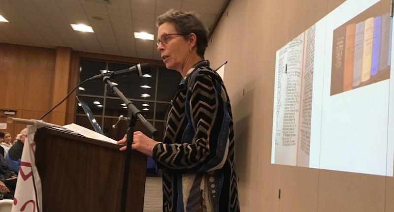

## Introduction {-}

Who tells our stories? And what do these stories tell us about what we value?  

For 15 years, I wrote local history essays for the magazine, *West Hartford Life*. I’m not sure how I wrote more than 140 essays while I was raising a family and teaching high school history full time. These monthly articles continually put me in the position of my Conard High School history students --- a deadline, a topic, establishing a context, evidence, and ferreting out cause and effect. This work helped make me a better teacher and community member. I was able to use my historian skills at the local level to help community members examine who we are as a town.

As I wrote these articles, and as you read them, individually, and as a whole, think about how they define what we value as a community. What events included all types of people? Which events excluded people? Which reinforced who had power and which gave power to those who didn’t have it before? Whose voices were heard? What documents can give us a window into the past? Is the story about an individual or is it more about the context in which this individual lived? How do present day issues help to define what we want to know about the past?

My love for this town comes from the involvement of so many citizens in striving to build a better community: a place based on justice, equal opportunity, a desire to join together to attack problems, and a love for those who live here. That is not to say that our actions in this town are always just, or that there is equal opportunity for all. Not everyone is a joiner, and not everyone is loved. But I dare say that many in this town make it their work to move toward those noble goals. You will read here about equality and differences. For example, you’ll read about our first meeting house, Lemuel Haynes, Amos Beman, Thomas Barrows, when we became our own town, Edith Beach, Susie Butler Andrews, Dr. Caroline Hamilton, the League of Women Voters, attempts to build affordable housing, Korczak Ziolkowski, Soviet Jewish emigres, school Superintendents, people who died in the many wars, and about pioneer Olivia Shelton.

Former Connecticut State Historian Chris Collier argued that he could teach United States History by teaching Connecticut history. There is much to be said for that sentiment. For the stories here about West Hartford teach us about equality, democracy, justice, rights and rebellion. Local history, too, can teach U.S. History.
