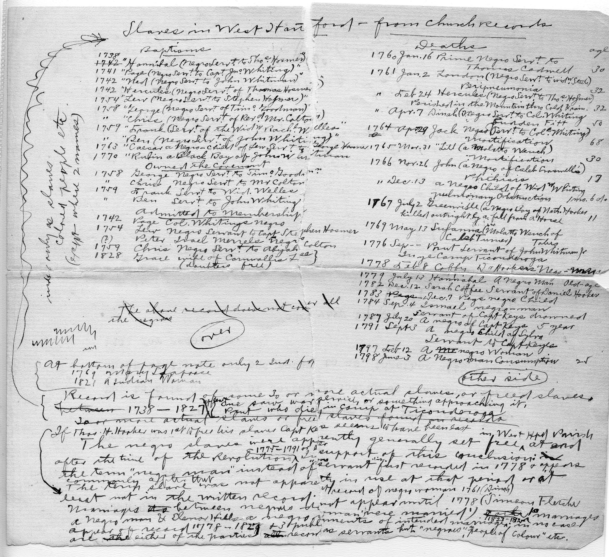

## Whitman on Slavery {-}

*June 2018*

Sometime between 1901 and 1914, West Hartford’s Town Clerk, Henry C. Whitman (1864-1952) made a list of all “negro” Baptisms, Owners of the Covenant, Admitted to the Membership, and Deaths, gleaned from the pages of the First Church of Christ West Hartford’s vital records.

Whitman found that between 1738 and 1827, as many as 50 people of African descent lived in the West Division of Hartford (now West Hartford) and most of them were enslaved. Bristow Middle School (2005) commemorates one of those men. Bristow was part of a larger community of what were denoted in Church Records as “negro servants.”

At the Noah Webster House archives, in the Whitman Collection, you can find this 7 inch wide by 6 inch long legal letter, folded once. The letter has no date and fewer than 50 words.
The letter reads:

> Town Clerk,
> West Hartford, Conn.
>
> Dear Sir:-
> Enclosed find a mortgage deed from Henry A. B. Day to this Company of certain property on Westland Avenue, which kindly record and return to us, together with your bill for recording.
> Yours Very Truly ,
>
> C?? P. Day
> Secretary
>
> Enclosure

When Town Clerk Whitman received the letter, probably in the early 1900s when Westland Avenue was being developed by Henry Day and his father’s construction company, he filed the mortgage deed and kept the note on his desk.

Then Whitman used the piece of paper to record what had been lost from memory, and possibly what he thought was lost from the story of the town’s past. Whitman not only copied them all out; he analyzed what he recorded.

Many West Hartford residents are surprised to learn that so many people of African descent in the West Division of Hartford were owned by town leaders, ministers, and the wealthier sorts and that so many enslaved people lived here. In 1790, at the time of the first census, there were close to 1,000 people who lived here, in about 150 families. Of those, at least 25 of these families --- as many as 15% --- owned people of African descent at some point in their family’s history.

On the back of this letter, under the heading “Slaves in West Hartford - from church records,” Whitman wrote out the names and made these categories:

- Baptisms
- Owned the Covenant
- Admitted to Membership
- Deaths

He listed the names from the church records under each of these headings, documenting men, women and children who were enslaved between 1738 and 1827. In all, Whitman wrote,

> Record is found of some 30 or more actual slaves, or freed slaves 1738-1827. At least one saw war service, or something approaching it, “Prot.” who died in camp at Ticonderoga.

“Prot.” is listed under Deaths with the following note: “1776 Sep --- Prot. servant of John Whitman, Jr. in ye Camp Ticonderoga.” Here Henry must have stopped when he wrote his own surname, Whitman, realizing that John was his ancestor.

The first in the list is Hannibal, negro servant to Thomas Hosmer, baptised in 1738. Thomas Hosmer was the grandson of one of the first proprietors, also Thomas Hosmer, who owned at least 300 acres north of the center. Just north of where the American School for the Deaf is today, his father, Stephen Hosmer, built the first mill in town. Stephen, according to Town Historian Nelson Burr, “became one of the richest landlords, farmers and traders in the Connecticut Valley.” He became a communicant of the Fourth Church of Hartford in 1725 under Pastor Nathanael Hooker. He married Susanna Steel in 1734. According to Whitman’s notes, his “negro servant Hannibal” was baptized on November 5, 1738. Five months later, in April 1739, Thomas and Susanna had their first child Thomas who was baptised. In 1742, Thomas bought a second man, “Hercules (Negro serv’t of Thomas Hosmer),” who was baptised in that year.

In 1742, Thomas was chosen Moderator of the church and re-elected through the 1760s. He was one of the citizens voted to take care of the schools, and to help build a new school house. In 1757, he took on the label Esq. In 1761, Whitman catalogued under “Deaths,” Feb. 24 Hercules (Negro Serv. to Thos Hosmer), age 32.

In January 1777, Thomas Hosmer wrote his will and died in that same month. In his will, he freed Hannibal:

> I have given my negro Hannibal his home and yet by the law he may be chargeable to my Estate if he shall be impotent and unable to provide for himself, if such a thing should happen I order my six sons to provide for his prosperity in equal proportion, but if he be lazie and idle and spend his time foolishly I desire that they will take care that the selectmen will bind him out.

The church records reflect his status as a free man by listing Hannibal’s death as transcribed by Whitman:

> 1779 July 13 Hannibal A Negro Man Old Age

We don’t know if Whitman actually saw that Hannibal had been freed in copying out these records, if he hadn’t seen the will. But one piece of his analysis leads us to believe he did:

> If Thos. H. Hooker was 1st to free his slaves Capt. Keyes seems [to] have been last. The negro slaves were apparently generally set free in West Hfd Parish at end after the time of the Revolution 1775-1791. In support of this conclusion is the term “negro man” instead of “servant” first recorded in 1778 + appears commonly after that.

Why did Whitman transcribe these records? Did he want to know that his ancestors owned Prot. and Rubin, a Black Boy? I wonder if he ever showed the list to anyone or if he shared the information with his wife, his children, or the leaders of the town? Was it only for his own edification, for his own understanding of the colonial world? We do know he kept the sheet and it made it from the church records to the Whitman Collection at the Noah Webster House.

Now the Witness Stones project, begun in 2018, will shine a brighter light on these women, men, and children who have mostly been forgotten. The Historical Society will place markers in the sidewalks at houses where enslaved people lived. These men and women helped build our community and our churches through their work, yet, for so long we only recognized them as property here. Acknowledging the existence of this inhumane system of slavery is a first step in addressing issues of race in our community today. It must have been a jarring step for Whitman as well.
