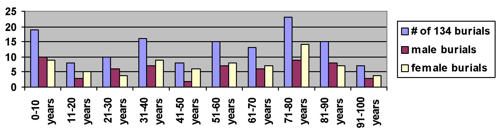

## Ye Olde Burying Ground {-}

*Originally appeared in West Hartford Life, January 2002*

Historians have several motives when they analyze artifacts and documents. We try to get a good story from them, have them make connections among people, make them capture a moment, and show how they reflect change. A visit on an afternoon in West Hartford’s Old Burying Ground on 30 North Main Street will provide you with the best light to read the stones and a way to understand the connections and tensions between people in a colonial community.

In West Hartford’s Old Center Burying Yard, whose first burial was in 1725 and whose last was in 1868, there are differences in how the dead were memorialized, depending on wealth and status, gender, race, and era in which they were buried.

During the Great Depression (in 1934), workers for the federal government’s Works Progress Administration surveyed the 137 graves and recorded their findings. With today’s data base computer capacity, it is easy to make a demographic study of those 137 people (though there are only dates for 134). There are 64 women and 73 men recorded.

The statistics show that life was good in the West Division of Hartford, especially in comparison to what some had left in England, and what some of the first settlers had suffered in the early 17th century. Taken by decade, the most people died in their 70s. Once people lived to be 10, their chances of survival, and even living into their 80s and 90s, were quite high. Thomas Merrell, born in 1714, the year after the first church was erected in the West Division, died at age 100.

Today, more women live into their later years, but in colonial times, this seemed not to be the case, with more men than women living into their 80s and 90s. Many women died in childbirth. Rachel Webster, first wife of Abraham, (the oldest brother of Noah Jr.) died at age 21, in childbirth. Her infant was never named and died after 7 days. While more men than women died in their 20s, more women than men died in their 30s and 40s, perhaps showing that childbirth became more dangerous, the older the woman.

When you walk into the burial ground, you walk into the “new” section, which has burials from the 19th century. The old section, which is about two-thirds of the acreage, fills the northern section of the yard. You can immediately see a difference in the size of the stones. None in the old section are more than three feet high. The new section has two large obelisks that commemorate the Talcott (of Talcott Junior High and Talcott Mountain fame) and Stanley families. By the 19th century, the idea of individualism had made its way into American society and the large size of the tombstones shows that wealthy families wanted to distinguish themselves from others.

In the colonial section distinctions between the rich and poor are evident, but the difference is not as pronounced. Differences can be noted in the size of stones, the existence of a footstone and elaborate carving.

The largest stone, though, is not based on wealth, but on status in the community. It commemorates the death of Reverend Nathaniel Hooker who passed away in 1770 at age 32 after serving the Congregational Church for 12 years. His stone is the only tablestone in the burial ground, but is in a sad state of disrepair. The four pedestals collapsed a long time ago and are stored at the Noah Webster House. The bottom slab and the top of the table can be viewed in the burial ground. The full inscription on the “table” details Hooker’s contributions to the town and champions his role as the best-educated man in the community. He was known as a brilliant man who ministered well. His role as doctor, however, did not serve him well in that he treated himself with mercury, leading to his demise. This tablestone can be found in the center of the east side of the burial ground.

Men’s graves tended to be larger than women’s and more elaborate. Samuel Stanley, who died at age 38 in 1787, had both a headstone and a footstone and his stone is much larger than that of his wife, Anna, who died at age 33 in 1780. Anna had no footstone. This reflected women’s partnership with men, for they are buried next to one another, but also represents the patriarchal society in which they lived.

Only one African American’s grave is marked in the burial ground, though I believe more are buried there. A man by the name of Bristol has a gravestone standing alone in the northwest corner. His stone reads, “Bristol, An African, Died 1814.” It is a simple but powerful remembrance of a man who bought his freedom from Thomas Hart Hooker in 1776 and who gained a reputation for his agricultural knowledge in his adult life. West Division farmers often consulted him. However, he could not be buried “among” them, and he was only given one name on his tombstone. Like his membership in the church, his location was separate in the burial ground.

A walk in the Old Burying Yard brings you back to another place and time. But it also jars you with the underside of life in the 20th century. The gravestones are in a bad state of disrepair. Trees and weeds compromise the stones. Lichens grow. And the writing on many of the stones is no longer readable. Vandalism from 1990 when 34 stones were damaged has still not been repaired. Can we afford to leave this window on the past in such disrepair? What does this tell us about our connection with those who came before us?
