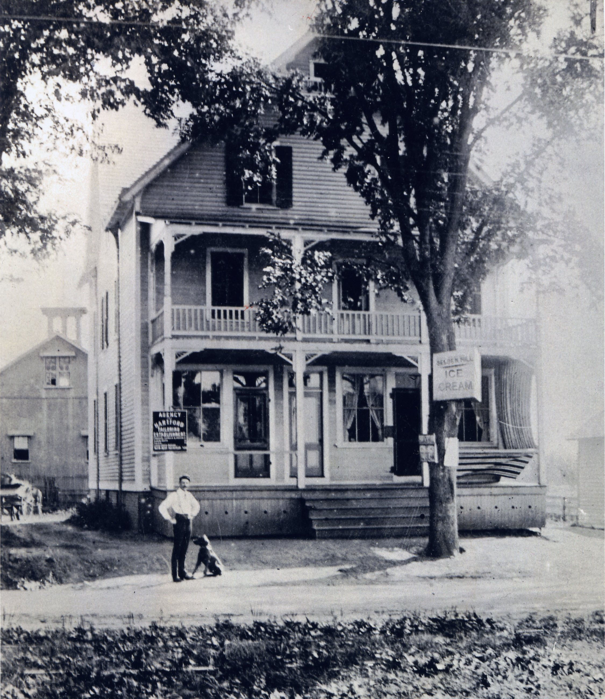

## Henry Selden: A Man Who Changed with the Times {-}

*Originally appeared in Hartford Life, December 2001. Thank you to Bob Strickland, a long time resident of Selden Hill, who wants to keep the memory of the Seldens alive, and lent me several articles.*

The life of West Hartford resident Henry Hezekiah Selden (1854-1932), symbolizes the sweeping changes in the United States as the economy and technology modernized our nation. Historians have described how the Second Industrial Revolution in the post Civil War period revolutionized the lives of average Americans. How did a man like Selden adapt to these changes while he retained his life as a traditional dairy farmer?

In 1776, the Selden family moved to Great Hill in what was then Farmington. When Henry Selden was five, in 1859, West Hartford annexed about 330 acres known as Selden Hill and now known as Buena Vista, in response to a petition by Henry’s uncle, Hezekiah Selden. This section of land is bounded by the reservoir on the north, Farmington on the west, West Farms Mall on the south, and Cornerstone Pool and the skating rink on the east.

By the mid-1800s, most New England farms had become dairy farms. With the new Erie Canal and railroad transportation, the opening of fertile land in Ohio, and the move westward, it was no longer profitable to grow wheat here. In the 1850s, some farmers in West Hartford grazed sheep, but the Selden’s chose to keep cows.

Henry attended the West School, a one-room schoolhouse that still stands on Mountain Road and now houses the West Hartford Art League. In the early 1870s, he spent a semester or two at Williston Academy in central Massachusetts to complete his education. He returned to the farm at Selden Hill to work for his father.

As a dairy farmer, Henry cut and delivered hay in the summer, cut ice on Wood Pond in the winter, mended fences, and cared for livestock. The farm had 25 to 30 head of cattle, four horses and 150 acres of farmland. Their property had eight outbuildings and a 12-room farmhouse. A farmer who held 50 acres of land could live a good life.

Henry’s interest in new inventions started early. In the mid-1860s, when Henry was still a child, he watched men build the reservoir across Farmington Avenue from his parents’ dairy farm. Some of the workmen stayed at the Selden Farm while on the project. One of these workman’s jobs was to feed the horses and young Henry was fascinated by the small Seth Thomas alarm clock, which awakened him every morning. According to his granddaughter Dorothy Selden, the young worker was willing to trade the clock to Henry for some useless trinkets.

Henry’s fascination with things mechanical must have been piqued by the new pump organ at the First Congregational Church in the center of town. This church, the third building, was on the northwest corner of Farmington and Main and stood until 1957. Henry got a job in the church as the first boy to pump the new organ.

Henry’s interest in things technological continued into early adulthood. In 1876, when he was 22, he and his mother, father, aunt and uncle made the journey, by rail to Philadelphia, to celebrate the centennial of the United States. On August 21, the group of five set off for this city on the train from Hartford to New Haven. They boarded a boat in New Haven for New York City where they again boarded the train to Germantown Junction, Pennsylvania where they checked in at a hotel opposite the Centennial Exposition in Philadelphia. They stayed in Philadelphia for five days and Henry kept a diary of his visit. The exhibits from China, the Sandwich Islands, Belgium, and England intrigued him.

But he was most interested in Machinery Hall, the Saw Mill, the railroad exhibit and a printing shop. When his parents and aunt and uncle returned to the hotel, Henry stayed and rode the cars around the Centennial Exhibition. The next day they toured again, and Henry returned to Machinery Hall. He was so intrigued by the building, that in later years he named one of the buildings on his farm Machinery Hall. After a five-day visit, the Seldens took the 7:10 train out of Philadelphia, arrived in New York City at 10:30, hired a carriage, drove through the botanical gardens there, and arrived in Hartford by train by 9:30 p.m. The technology in Philadelphia intrigued the young farmer from West Hartford.

Henry, according to his granddaughter, preferred to work with machines rather than the soil. His interest in machines led him to build a mill on his property where he cut lumber for himself and his neighbors. He built a lathe powered by horses on a treadmill and he had his own repair shop and blacksmith shop.

Henry married Sarah Whiting in 1888 when he was an established bachelor at the age of 34. They went on to have eight children, and Henry taught them how to work on the farm. At the age of five, they started to do jobs on what was a prosperous farm. Most of Henry’s income came from milk, butter, and hay. There were times when he allowed his six and seven year olds to take his hay by themselves with their wagon to Hartford. His daughter, Rilla Selden (1898-1987) remembers wrapping pounds of butter in parchment and sitting high on the horse-drawn wagon with her father as he traveled his delivery route and getting down at each house to deliver the fresh butter at 25 cents per pound.

Henry was always looking for something new. Between 1898 and 1902, he and his sister-in-law opened the Selden Ice Cream Parlor in West Hartford Center at the present location of the Treva Restaurant. It was at the end of the trolley line that made it from Hartford to the center by 1889. According to Selden’s granddaughter Dorothy, the ice cream parlor was the first to use fresh fruit in their ice cream. The store closed when a nearby drug store began to serve ice cream

Henry Selden bought his first car in 1918 when he was 64. He enjoyed riding in it, but decided not to drive it because he was so hard of hearing by that time that he couldn’t tell whether the motor was running. Once, when he did decide to drive it on the farm, he was heard yelling “Whoa! Whoa!” to stop it.

In 1926, 50 years after his trip to Philadelphia to celebrate the U.S. Centennial, Henry and two of his sons, Irving and Roland, took their Model T to Philadelphia for the U.S. Sesquicentennial. The fact that Henry enjoyed this celebration as much as he did as a young man is a testament to his willingness to use and learn about modern technology. He learned how to integrate it into the workings of his already established farm.
