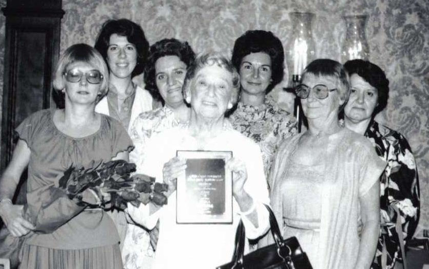

## The Life and times of Edna Purtell {-}

*Originally appeared in West Hartford Life, February 2007*

I first encountered Edna Purtell while writing my master’s thesis on the Connecticut Woman’s Suffrage Movement. She was known for her abilities as a speaker. In an interview, she claimed that she “never wrote any of her speeches on paper, but I could consistently captivate audiences.” When I wrote last month’s *West Hartford Life* article on William Purtell, a Republican Senator from West Hartford, I realized that the two were brother and sister and yet they seemed to have diametrically opposed political views.

Edna Purtell (1899-1985) was born on Albany Avenue in Hartford, the daughter of a cigar maker. Her father was a member of Samuel Gomper’s Cigarmakers Union. Her father, apprenticed at the age of nine, became a leader in the Hartford union. In 1911, he fought to allow a black man into the union because he knew that blacks, just like the whites, paid the same 5¢ for a loaf of bread. Purtell’s mother was a cigar stripper who belonged to the union as well.

Edna Purtell graduated from the night high school. She held jobs as a babysitter, clerk at the five and ten, and as a tobacco stripper at Doyle’s Tobacco Shop. At 16, she was elected secretary of the cigar strippers’ union. By age 18 she went to work at Travelers Insurance Company in the filing department. Edna’s brother William was two years older than she. While Edna identified with the working class, her brother became an entrepreneur.

In her spare time, Purtell volunteered in the woman’s suffrage movement, handing out leaflets in downtown Hartford and going door to door to get signatures on petitions. A chance encounter in 1918 in front the of Brown Thompson Department store between Purtell and Katharine Hepburn (the actress’s mother), the head of the Connecticut Women’s Party led to Purtell taking the train to Washington to demonstrate. There she was arrested in front of Woodrow Wilson’s White House and fined. Purtell represented working class women, and took the train to D.C. and got arrested four separate times and was finally thrown in jail for six days and there she went on a hunger strike all in the name of woman’s suffrage. She was also arrested for climbing Lafayette’s statue and proclaiming “Lafayette, we are here.” Lafayette, a French general during the American Revolution, was a champion of liberty. The police broke two of Purtell’s fingers snatching her suffrage sash while arresting her.

When she returned to work after protesting, Travelers President Batterson called her down to his office.He said, "You know, Miss Purtell, you're liked very well here, but we don't want you to be talking about suffrage and so forth." She replied, "Mr. Batterson, during work hours I'll take care of my job. But once I get in that elevator, what I talk about is my business, not yours. And on our coffee break, that's our coffee break, and I'll talk about anything I want." Batterson never said another word to her and Purtell’s characteristic honesty prevailed.

Purtell’s suffragist activity with the Connecticut Woman’s Party was more radical than the work of Connecticut Woman Suffrage Association. When women won suffrage in 1920, the more conservative women from the CWSA formed the League of Women Voters. Instead, Purtell became one of the first members and a leader in the State Federation of Democratic Women’s Clubs. Even into the 1970s, when the League became a more progressive group, she never joined.

Purtell served on many committees and was often the keynote speaker for these groups. In 1924 she supported Progressive Robert LaFollette for President because he supported the initiative, the referendum and the recall. She supported the movement to free Ireland from British rule. In 1928, she helped organize a “Women for Al Smith” committee to support the Democrat running for President. In 1930, Purtell was elected Parliamentarian of the Hartford Women’s Democratic Club. She served on the legislative committee which followed bills in the state legislature. She lobbied for jury service for women, old age pensions, and improving the status of women in factories. In March 1933, at a meeting of the Connecticut Women Democrats, Purtell reported on the conditions of jails for women in Hartford County. She said the cells were unsanitary and the women did not have enough freedom. In 1936, she was an alternate to the national Democratic Convention which nominated FDR for a second term.

Her interests were wide-ranging. In May 1934, Purtell was part of a group which sponsored a symposium on Nazi book burning. She joined the pastor of the Center Church, the head of the Seminary, two rabbis and Annie Fisher, the Superintendent of one of the Hartford school districts, to raise awareness of the public.

While Purtell immersed herself in Democratic politics, her brother opened a factory called Holo-Chrome and by World War II he had bought Billings and Spencer in West Hartford. Then he began to dabble in politics himself. *Hartford Courant* political writer Jack Zaiman claimed he too, was a great speaker, but his view of the role of government differed from his sister. He thought that social problems should be solved through private initiative first and only then through government action.

His sister may have agreed with him about labor issues for men who tended to have strong unions, but she believed strongly that the government needed to regulate businesses.

After several years at Travelers, Edna Purtell got a job as an investigator for the Connecticut State Labor Department. She gave a speech at a rally to support a state pension plan. In 1936, she exposed a case where a dressmaking shop in a Hartford department store made women work more than a nine hour day. She worked for the department for 14 years and was a pioneer for protective labor legislation, particularly for children employed in the state tobacco fields. She wrote a pamphlet for the Labor Department in the 1940s on children in the tobacco industry. She led the fight to end child labor in Connecticut and in 1946 outlined the problems of child labor in a news article. There was no minimum age for agricultural workers and the children worked as many as ten hours per day.

In 1948, the Connecticut Democratic Women’s Convention asked Purtell to be their keynote speaker. It was thought that she might have a place on the state ticket for elective office. At that time she and the Democratic women called for an end to the regressive sales tax and for a progressive income tax. However, she never ran for political office. Senate nominee Thomas Dodd, a Democrat, named her to head his office on women’s concerns in 1956. In that role, she worked for the man who ran against her brother.

After she retired from the state in 1956, she remained politically active. Governor Dempsey named Purtell to Connecticut’s Permanent Commission on the Status of Women in 1966. When the Equal Rights Amendment was revived in 1970, Purtell was one of the first to testify before the legislature’s Human Rights and Opportunities subcommittee headed by Gloria Shafer (who later became Connecticut’s third female Secretary of State). Purtell defined herself as “an old style militant suffragist” claiming that even after women got the right to vote, they “were still not persons.” In 1975, at age 76, Purtell was still active politically. She published a letter to the editor supporting a state income tax and supporting Homer Babbidge’s run for Governor. At that time she served on the legislative committee of West Hartford’s North End Senior Center, continuing to monitor and lobby for legislative measures.

Purtell lived more than 40 years in West Hartford, well into her 80s. While her brother’s political career took him to Washington, it lasted only six years in the U.S. Senate. Edna continued her role as an activist throughout her life, speaking for the rights of those who had the smallest voice.
