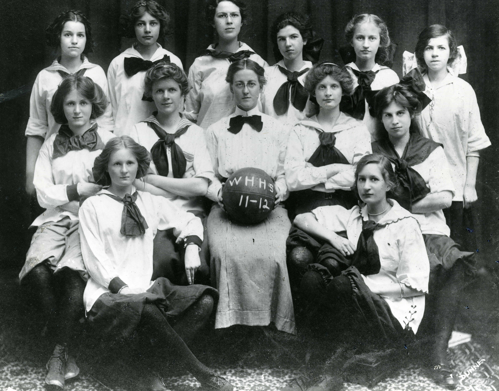

## Louise Day Duffy {-}

*June 2018*

If you enter Duffy Elementary School on any morning, you will hear the Duffy “pledge” over the loudspeaker:

> As Duffy citizens,  
> we show respect,  
> demonstrate compassion,  
> and take responsibility for our learning and our actions.

That is a motto that Louise Day Duffy could embrace.
Her matronly portrait that hangs in the hallway of Duffy Elementary School belies the active life she led as an advocate for students, the poor, women, and those without a voice. In 1949 when the Board of Education voted to name an elementary school after Duffy, they showed their support for these moral ideals and her belief in public service.

Louise Day Duffy (1885-1973) joined many politically active women in West Hartford by breaking the mold about what was acceptable for women in the first half of the 20th century. Her leadership in our town is remarkable.

When Louise Day was 11, her parents moved from Avon with their seven children to Raymond Road; her father helped develop Frederick Rockwell’s Boulevard with the median down the middle between Trout Brook and South Main Street. Her father’s contracting business, P.R. Day & Sons included two of Louise’s brothers and they built a number of homes on Raymond Road near Boulevard and on Westland Avenue. Her father served as Justice of the Peace, and as the first chairman of the Business Men’s Association (later the Chamber of Commerce). Louise Day’s father figuratively and literally built community. Later they moved to a house on Outlook Avenue when the area had a 10 hole golf course.

Louise Day graduated as the valedictorian from the West Hartford High School in 1902 in a class of four students, the first entering class at the school. She went on to study at Smith College, graduating in 1906. She taught for one year at Windsor High School until Superintendent William Hall persuaded her to come teach English and Math at her alma mater. She taught and coached there for four years, from 1908 to 1912.

The basketball photo shows a 26 year old Louise Day as the coach of one of the first girls’ basketball teams at the West Hartford High School. Just as today, her athletes had long hair secured to keep it out of their face as they played on the court. Their knickers, stockings and neck ties, variously displayed, showed the individuality of each of the young women who built the team. Though no one in the picture is smiling, they exhibit a sense of determination and pride, and respect for their coach, qualities that Louise Day carried through her life.

Between 1912 and 1915, Louise Day left West Hartford to be secretary to the superintendent of the Horace Mann School in New York. When she came home, Louise married Ward Duffy (1891-1961), the year he graduated from Trinity College. She met him at the West Hartford High School where he was a 1911 graduate. Duffy’s family lived at 208 North Main Street in the John Whitman house. Ward’s father, Frederick (1864-1928) had been a high school teacher in upstate New York, but looked for a place to live where he could farm. He found their house along a section of Trout Brook which was called Whitman Falls. His wife Elizabeth grew up on a 400 acre farm just south of the Canadian border. Duffy “farmed from the book,” and grew a herd of Jersey cattle and sold milk. He ran for office and served on the first Town Council in 1921. He later became editor of the *Hartford Times*.

Louise and Ward Duffy had five children: two boys and three girls. Louise ran the household and raised her children (born between 1917 and the mid-1920s). She was one of the founders of the Hall High School Parent Teacher Association in 1924 and one of its first presidents.

Duffy got involved in the political world, first in the Connecticut Woman’s Suffrage Association with Katharine Houghton Hepburn, and then, in 1923, at age 38 she helped found the League of Women Voters in West Hartford. The purpose of the League, was to get women politically involved in voting and running for office.

And run she did! In 1924, she ran as a Democrat for the 5th Senatorial District seat in the General Assembly against Republican Huntington P. Meech, a 46 year old insurance underwriter for Hartford Fire Insurance. Duffy campaigned supporting the Democratic platform which unabashedly appealed to liberal people. She shared the podium at a political rally at Yale in October 1924 with New York’s Governor Alfred Smith and Alabama Governor Brandon.

She wholeheartedly supported the Child Labor Amendment to ban child labor. She also supported shorter hours for women in industry. She supported good education and felt she would be a good representative in the legislature because of her background as a teacher. She said the “supreme question in this election was whether the state government should be run by the people or by one man who dominated everything.”

Duffy did not carry a single town in the district. According to the *Hartford Courant*, “no doubt many Democrats voted against her on account of her pledge to vote for ratification of the federal Child Labor Amendment if elected.”  

While Duffy ran for Senate she served as the chair of the special committee on the Citizenship School of the League. Duffy organized the first school conducted by a local unit in the state. She ran the “school” over the course of three weeks. Duffy spoke on “Two Types of Politicians” and distinguished between machine politicians, who she said worked for their own interest, and the type of politician who served the common good. Duffy, who had a reputation as a liberal with an iron will, had just come off her loss in the 1924 state Senate election.

The first set of lectures was on the machinery of national, state, county, and town government. Professors from Trinity College and Columbia University ran these sessions. The second course focused on World Politics. Lectures included The World Today and America’s Part in It, History of the Peace Movement, Europe and the World Peace Movement, and How Shall We Lessen the Possibility of War?

The second set of lectures addressed political culture in the United States with sessions dedicated to a History of Political Parties in the United States, a Study of Platforms focusing on economic and political theories, honesty in government, education, civil service, conservation, foreign relations, tariff, taxes and finance, agriculture, labor, railroads, and civil liberties.

Even without television and the internet, Duffy’s attendees must have felt well equipped to cast their votes in November. The next spring she ran again, this time for Town Council from the Center District and failed to get the nomination. However, she continued working for the common good through the league, the Parent Teacher Association and then the Board of Education.

In 1932, Duffy went to Chicago as a delegate to the Democratic National Convention. She sat in the front row at the convention hall taking in the the first speech ever given at a convention by the nominated presidential candidate, Franklin D. Roosevelt. The Connecticut delegation was sharply divided between Al Smith and FDR, and Duffy put her support with FDR. After he was nominated, according to the *Hartford Courant*, she “was among the members of the Connecticut group who attended an after the business session and met the candidate and Mrs. Roosevelt in their informal reception.” From there, Duffy took on the mantle of the “New Guard” of leaders of the Democratic Party in Connecticut.

She served as vice president of the Connecticut Federation of Democratic Women in 1934 and at the same time served as the Vice President of the Connecticut State League of Women Voters.

Duffy’s statewide service included being chair of the state Child Welfare Association and a member of the Connecticut Public Welfare Council. She used her skills as an advocate for those without a voice. She met with the Prison Association to coordinate juvenile and adult probation services. And her testimony at numerous state legislative hearings can still be read in the Connecticut State Library collection.

In October 1935, Duffy headed a five member State Commission to Study the Pauper Laws. The Commission, named by Governor Wilbur Cross in the middle of the Great Depression, was prompted by the passage in August 1935 of the federal Social Security Act, establishing a federal system of old-age benefits for workers, victims of industrial accidents, the unemployed, dependent mothers and children, the blind and the physically handicapped. Until this act, it had been families and towns who took care of the poor. With the Great Depression, towns were no longer capable of fulfilling that responsibility and people were no longer willing to accept that poverty came with old age.

Here in Connecticut, Duffy continued to be concerned about the stigma attached to monetary help from the government and the term “pauper.” The term had the connotation of being poor, “shiftless, incompetent and derelict,” and as the state and federal government turned to providing old age assistance checks of $30 per month, Duffy and her commission wanted to change that stigma tied to government issued aid. At that time, anyone receiving town aid was named a pauper.

Duffy’s commission found that the history of being a pauper in 1635 included all needy people. Slowly, people were removed from the weight of the pauper designation: in 1650, neglected children, in 1699 the insane, in 1711 the diseased, in 1812 the deaf, and in 1820 the blind were no longer considered paupers. The unemployed on direct relief, those who did not work regularly, and those who were retired were still considered paupers in 1935. Duffy and her Commission were able to remove senior citizens getting an old-age pension from the list.

In West Hartford, the Town Council appointed her to the West Hartford Library Board (1936 to 1938). They appointed Duffy to the school board in 1938 and she served until 1948. She was the first Democrat on the Board in 15 years, and just the second woman. She was quickly named secretary and served through the end of the Great Depression, World War II and the rapid suburbanization that began after the war.

In 1946, as a member of the League of Women Voters and the Board of Education, she helped write a press release urging the Town Council to appoint another woman to the Board of Education. It was not until 1958 that this became an elected Board.

Duffy’s public service exemplifies a woman who used her abilities to improve the lives of others, both as a role model and a spokesperson for people who didn’t have a strong public voice. From her position, she saw government as a force of good in building community and she acted on her beliefs. Those values which include respect and compassion continue to be carried on at the school named after her in 1949.
