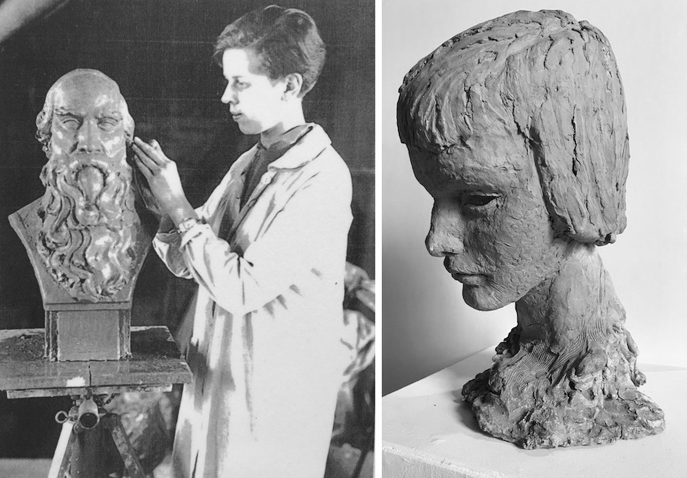

## West Hartford Art League {-}

*Adapted from a talk delivered at the West Hartford Art League, April 9, 2016*

In 1933, two artists organized the West Hartford Art Center to provide instruction in painting, drawing, sculpture, oil, pastel, watercolor, terra cotta and linoleum. Housed on the second floor of a vacant school building at 14 North Main, both children and adults flocked to the Center to hone their skills in rooms set aside for artists. The Center grew out of the friendship between artists Gertrude Patterson (1882-1952) and Rebecca Field (1905-2002) who shared a studio in the old school building.

From the instructional Art Center, grew the idea of an art league to bring together West Hartford people interested in various aspects of art in an organization that would give the community a center for art activities. The West Hartford group modeled their organization after successful art leagues in Springfield and New Britain.

The West Hartford Art Center became the West Hartford Art League (WHAL) in 1934 and, originally, the old Center School provided an ideal place for creative expression. Their space included a stage for modeling, large windows facing south and lilac trees and woodbine out the windows. Those who became members got to use the studios, received free instruction weekly in drawing and painting, could exhibit their art, and could attend functions including lectures, social gatherings, and exhibitions. The League wanted to stimulate interest in art in West Hartford and the vicinity.

The League held an art appreciation discussion group every Wednesday night. In 1934, when the Picasso Exhibit came to the Avery Memorial at the Wadsworth Atheneum it was the first major retrospective of his work in the United States. The WHAL sponsored a talk and discussion on Picasso’s work both for those in the League and those in the community.

But, the artists shared the Center School with dancers and singers and they yearned for a space of their own. When Sedgwick School was completed in 1931, the West District School closed, and this building became a possibility for the WHAL. In 1935, the president of the Art League went to Town Manager Rodney Loomis to request larger quarters for the growing art group. Loomis recognized the space issues of the league, and offered them the building. League members felt its central location trumped the problems with the building. It had no plumbing or central heating and only a wood stove. Members had to carry water in pails from a neighbor’s house before holding their spring exhibition and tea party in 1935.

The League had to raise money, and they made it fun. They held teas and fundraisers to fund a furnace. By 1939 they raised enough money to build a kiln. They hired Simon Kelsey, a well known pottery artist, to conduct classes in pottery making.

Gertrude Hough Patterson and Rebecca Field met at the Art Center and partnered to found this organization and make it work. They were of different generations, Patterson at 50 and Field at 27 when they founded the organization. But they both felt that there was more to the art world than making their art and teaching students. While they started by giving art lessons, they soon realized they wanted an organization for the community of people who loved, appreciated and lived their art.

And Field and Patterson helped draw people to the League. Patterson worked in oil and pastel, as a portrait and landscape painter. She studied at the Norwich Art School, the Yale School of Fine Arts, the Eric Pope School, the Chicago Institute, and the Philadelphia Academy of Fine Arts. She taught at the Norwich Art School, Norwich Free Academy, in private schools and at Mount Holyoke College. One of her portraits hangs now at the WHAL.

Rebecca Field studied at the Mass College of Art in Boston and then, in the late 1920s for two years in Munich, Germany. On her return, she settled in Hartford and taught for 40 years at the WHAL. She often exhibited her watercolors, sculpture, prints and miniatures at the League building. Her sculptures, according to a catalogue of works done under the aegis of the Federal Arts Project, are largely female figures and heads of women students done in plaster and bronze and ranged from realism to decorative in purpose. Field also used watercolors to paint landscapes and marine scenes. She painted scenes from the Berkshires and Grand Manan Island off of the Maine coast, as well as scenes from her travels in Germany, Scotland and England.

Patterson and Field’s organization was actually buoyed by its start in 1933 during the Great Depression. The federal government funded many artists. When Franklin D. Roosevelt took office in 1933, he felt the federal government’s job was to help get the economy out of the depression by employing people in public works. Artists benefited from his relief measure to employ artists and artisans to create murals, easel paintings, sculpture, graphic art, posters, photography, theatre scenic design, and arts and crafts.

The first federal money came to the town through the Federal Emergency Relief Agency (FERA, 1933-35). Field worked with children in the West Hartford grade schools on an FERA project to provide instruction for the more talented pupils. She wanted them to have special art training instead of being slowed by instruction in classes where both talented and non-inspired pupils were subject to the same teaching. The FERA was replaced by the WPA and its Federal Art Project (FAP) in 1935 as the feds continued to think that employing people was the right thing to do. The WHAL found a way into the Federal Art Project (1935-1943) money. Though it did have a cultural impact, its main purpose was to get artists producing public art and to document American design. Artists created over 200,000 works, among them, some of the most significant pieces of public art in the country. Connecticut artists produced over 5,000 pieces of art including 107 murals, many of which still exist.

In West Hartford, Rebecca Field sculpted a bas-relief of William Hall for Hall High. As a WPA artist, she painted 39 works listed in the WPA inventory. In 1935, she painted a cultural and historical pictorial map of West Hartford for Connecticut’s Tercentenary Committee with FERA money. She included ten former citizens who were prominent in West Hartford history. Artist Walter Korder, also an active member of the WHAL, got paid $23.60 per week to paint murals at Charter Oak School and the old Hall High, now the Town Hall. The town only had to pay for materials.

By 1940, The West Hartford Art League was one of fastest growing organizations in town. Founded as a place where artists could meet, learn and become inspired, the organization built a community of artists and patrons and an appreciation for art carried on in the schools and by this organization today. While federal, state and local government has helped the League survive, continued public funding is needed for the organization and the arts to prosper.
