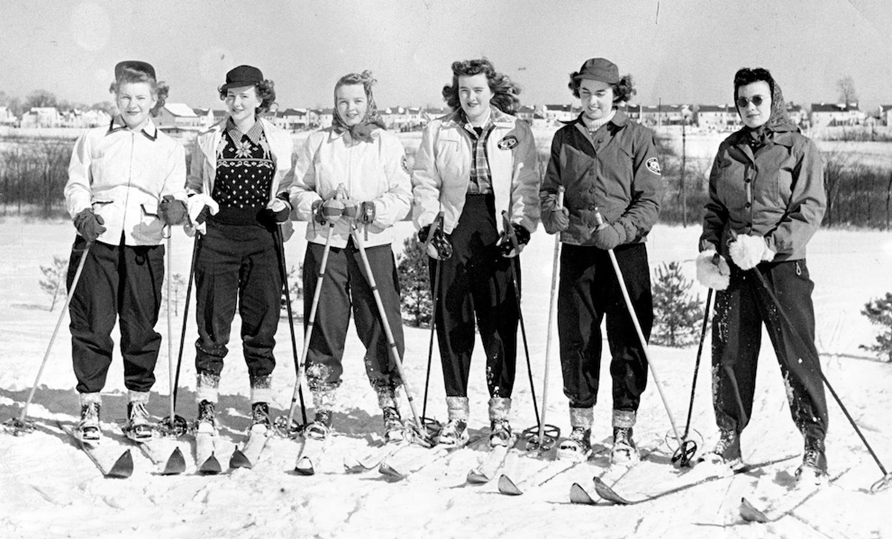

## Skiing at Buena Vista {-}

*February 2018*

When my kids were little, in the 1990s, there were big signs at Rockledge Golf Course disallowing sledding and skiing on a great hill off South Main Street. Now, the town has opened the course in a movement across the country to use parks in the winter as well as the summer.

In the 1940s, the town encouraged skiing and skating in the parks. The town bought the 70 acre West Hartford Golf Club for $20,000 in 1943.

The town used the course as both a summer and winter venue. The Recreation Department set up three ski trails at Buena Vista and provided a first aid toboggan. The West Hartford Outing Club organized activities on a “Practice” and “Advanced” slope. They also helped get the pond in shape for skating.

In February 1945, the ski committee of the West Hartford Outing Club sponsored ski racing at Buena Vista. Elementary, Junior and Senior High boys and girls ran a series of races in February with the hopes of winning an emblem for their ski jackets at the end of the season.

On the Sunday after Christmas in 1947, according to the *Hartford Courant*, over 600 people skied on the three slopes. By the second week in January 1948, the town provided lights for night skiing. There was also a hill for coasters and tobogganers.

The Recreation Department offered free ski lessons to both children and adults. By February 12, 1948, the Rec Department counted almost 8,000 skiers and skaters.

At the same time, the town set up a skating rink behind Hall High School (the present Town Hall in the town’s center). The rink was three inches of solid ice on the ground, so parents did not have to worry about their kids falling through. On January 22, 1948, the Rec Department planned to add lights. Students at Hall could skate during gym periods. Residents could also skate at Fernridge Park, Beachland Park and Buena Vista. All three places had warming huts for skaters.

On January 13, 1958, the Rec Department claimed 5,000 people “flocked to West Hartford skating, skiing, and coasting in one of the biggest turnouts in town’s history.”

As late as 1972, the Parks and Rec Department sponsored free downhill ski lessons at Buena Vista.

In 2017, the town has once again opened a golf course to the public in the winter. What fun to go cross country skiing at Rockledge. And, what about opening up some of these ponds to skating? Or having an outdoor rink at some of the parks or schools?
