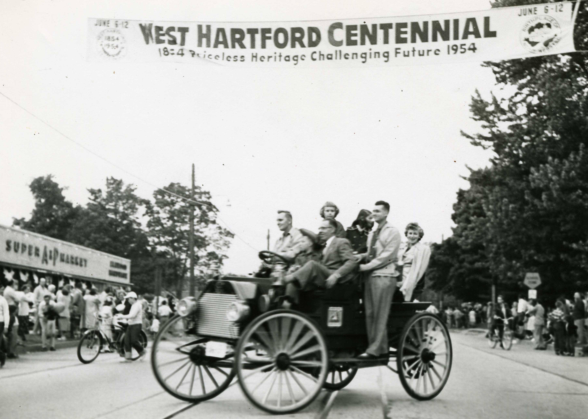

## How Should We Celebrate our Sesquicentennial? {-}

*Originally appeared in West Hartford Life, September 2002*

When I moved to Outlook Avenue nine years ago, the previous owners left behind a black iron trivet which reads West Hartford Conn., 1854-1954 surrounding an imprint of the then Town Hall with the Noah Webster statue in front. I knew this trivet commemorated the centennial celebration of our town, but I have just recently discovered that this trivet was just a small reminder of the community-wide centennial week celebration for West Hartford’s residents from June 6 to 12, 1954.

The Kiwanis Club sold these trivets for a dollar and used the proceeds for their Kiwanis Child Welfare Fund.

Reading about the events of West Hartford’s centennial makes me think about how West Hartford might celebrate its sesquicentennial that is less than two years away.

Planning for the centennial celebration began in 1950, four years before the celebration, when H.M. Feine, executive secretary of the West Hartford Chamber of Commerce called for a meeting of those interested, and Everett Dow, the Town Clerk encouraged townspeople to join up. The planners wanted a weeklong celebration at which they could define who they were as a town through their history and pageantry. A news article in the *Hartford Times* on February 2, 1950 depicts the town as “referred to once as the 'bedroom' of Hartford, the town has rapidly outgrown that name and is today one of the wealthiest residential cities in the United States with a population well over 45,000.”

Planning moved apace and by October 1953, the planners chartered the West Hartford Historical Society. By March 1954, more than 150 townspeople worked on 18 committees preparing for the celebration. The Centennial Commission coordinated the event. Clarence C. Boyce, the just retired president of the West Hartford Trust Company (now Fleet Bank), chaired the executive committee that included Mayor C. Edwin Carlson, Town Clerk Everett D. Dow, Town Manager Rodney Loomis, Leo Golden, Clarence Seymour, and U.S. Senator William Purtell, a West Hartford resident and business executive from Holo-Krome Screw Corporation. Purtell was the Honorary Chairman of the committee.

The 17 other committees included Reception, Chamber of Commerce, Program, Religious, Souvenirs, Public Information, Pageant, Dinner to Town Officials, Woman’s, Finance, Historical, Elmwood, Sports, Class Reunion, Speakers, Parade, and West Hartford Garden Clubs. Women served on just five committees: the Woman’s Pageant, Historical, Class Reunion, Parade and Garden Clubs. This was a people’s celebration reflecting as much about life in the 1950s as is did our past.

A historical pageant was the centerpiece of the celebration with 1,2000 students from the 15 public schools playing roles. Teachers Marjorie Rice from Sedgwick, and Ruth Tower from Morley wrote the script. The pageant committee included the two teachers, the curriculum coordinator for the school system, the director of elementary education, and music and art teachers. The Practical Arts teacher at Hall, Miss Catherine Stevenson and each PTO arranged for parents to sew 500 costumes using $2,000 worth of cloth. This pageant drew an audience of 13,000 people over its two-night run.

The West Hartford Armory on Farmington Avenue hosted an Exposition with 80 booths displaying West Hartford business and industry. This exhibit gave the “people of West Hartford an opportunity to see a visual display of the valuable contribution that local industry and business make to the Town, State and Nation,” according to Edward M. Flannery, chairman of the Centennial Exposition committee. This “progress exposition” included local industrial concerns, retail representatives from the Chamber of Commerce, West Hartford Schools, Girl Scouts, local merchants, the West Hartford Art League, Children’s Museum, and several Hartford insurance companies.

Historical and needlework exhibits opened at Webster Hall in the public library. The historical exhibit included pictures, furniture, documents, silver and china, and models of old West Hartford landmarks. The needlework exhibit displayed various styles and methods used by women over the past 100 years. These exhibits were free and open all week.

The program began on June 6 in the churches and synagogues of the town. At all church services on that Sunday, the commission wanted a special mention of West Hartford’s early beginnings based on religious convictions and a desire to form a fundamentally sound community. Nelson Burr, historian in the Library of Congress, and later West Hartford’s Town Historian, addressed a crowd of 200 on Sunday night at the First Church of Christ Congregational.

Governor John Lodge extended a tribute to West Hartford on behalf of the state from the First Church pulpit. President Eisenhower sent a congratulatory proclamation read that evening.

On Monday night, a committee sponsored a dinner at the parish house of the First Church to honor the founders of the town.

Tuesday night’s dinner at Rockledge was for town officials both past and present. A guest speaker, Edmund H. Harding from North Carolina, noted as a “tar-heel humorist,” entertained the crowd. Charles B. Beach, whose family donated Beachland Park and the Beach Park School to town, was master of ceremonies.

The Sports Committee arranged an outdoor basketball game at the Duffy School between Hall and New Britain High on Monday night. Sports events continued through the week with a track meet at Sterling Field on Tuesday night featuring Lindy Remigino who had just won his Olympic gold medal two years before. According to the program, several other nationally known athletes competed as well. On the last day of the celebration there was sports day at the Hall High fields including a baseball game between Hall and East Hartford High and a softball game between the Aetna Life Girls Team and the Travelers Girls Team. Little League games were scheduled throughout the town on Monday, Tuesday, and Friday nights.

Elmwood wanted to be sure to be included in the celebration and the VFW planned a Children’s Day on the Lincoln Dairy grounds east of the underpass on New Britain Avenue. The Elmwood Community Church decorated four rooms in “1850 style” for residents to visit.

Friday night at 7 p.m. the parade kicked off in the center with 21 floats and 12 bands. At the conclusion of the parade, the West Hartford Square Dancers hosted a festival at Sterling Field from 8:30 to 11:00. The week was capped off with a Saturday night fireworks display at Sterling Field.

How should we get as many townspeople involved as were 50 years ago and how, in the 21st century will we choose to depict our “priceless heritage” and our “challenging future?” In 1954, town officials, schools, recreation department, Chamber of Commerce, local industries, and the newly formed historical society were an integral part of both supplying the money and the time for planning the celebration. Six years ago, the Town Council put some seed money in the budget to get the plans moving, but those moneys have not been forthcoming over the last few years. Let’s get moving!
