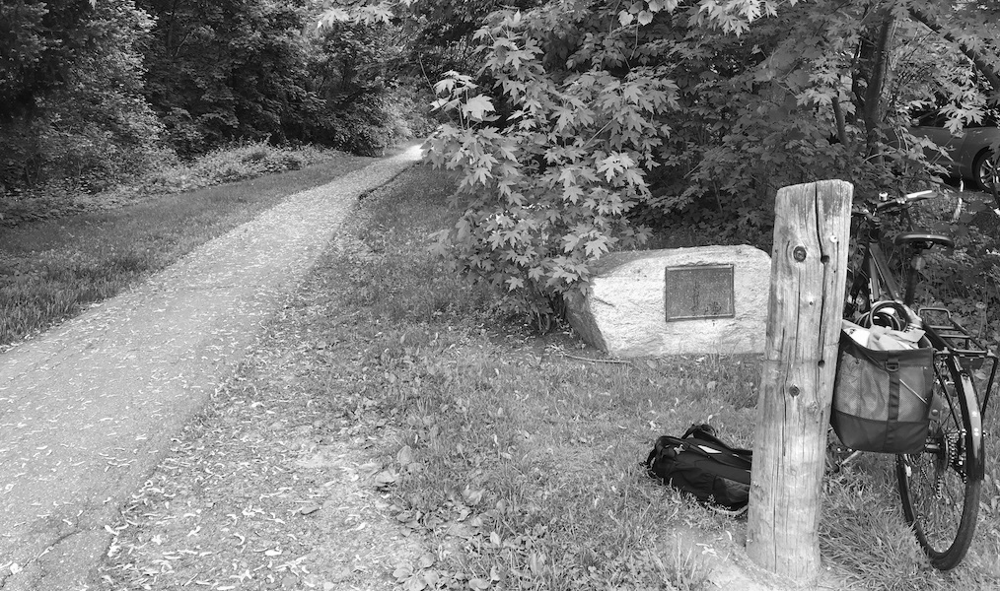

## What Are Your Boundaries? {-}

*Adapted from a talk given at Emanuel Synagogue, “Why Do You Live Where You Live?” November 2, 2017.*

If you walk or bike into Beachland Park from Manchester Circle, as so many school children did in the late 1950s, 1960s and 1970s to get to the Elmwood School and Talcott Junior High, right to the south of the path is a stone with a plaque. The plaque, mounted on a stone says,

> THE FELDMAN WALKWAY  
> THIS WALKWAY  
> IS NAMED BY THE TOWN COUNCIL  
> IN HONOR OF  
> RABBI ABRAHAM J. FELDMAN, D.D.  
> DISTINGUISHED CLERGYMAN  
> AND CITIZEN OF WEST HARTFORD  
> NOVEMBER 10, 1958  
> DEDICATED JUNE 1960  

Why was Rabbi Feldman (1893-1977) commemorated at this particular spot in 1960? Who paid for this? And why would it be in the south end of town, which was not known to be a place where many Jewish people lived?

Historians who study settlement patterns for Jewish people and African Americans in cities and suburbs look at many factors that contribute to where they live in communities. Redlining by banks, real estate agent steering, federal housing funding, vicinity to houses of worship, and education are among the many factors that both narrow and broaden choices for homeowners.

Through interviews with Jewish people who moved to West Hartford in the 1950s or 60s, we learn that it was “understood” by many that they could not live in certain neighborhoods. Informal exclusionary boundaries included Sunny Reach Drive, Westwood Road and Colony Road near the Hartford Golf Club, the West Hill District, on Hunter Drive on the mountain, Sunset Farms and Wood Pond. Though no written restrictions by race or religion have been found, often in these neighborhood associations, houses never went on the market, but were passed along by word of mouth to family members or those who were deemed to be “appropriate” to live within the bounds of their neighborhoods.

And even if a Jewish family offered $30,000 in cash to buy a house along Farmington Avenue, their real estate agent might report back that the seller took the house off the market, rather than sell to them.

So while bankers, federal mortgage programs, and real estate agents have been the targets of restrictions on who lived in neighborhoods, in West Hartford, it was also builders who controlled the market. As builders flocked to town to buy up farmland in the north end, the southwestern section of town and the center of Elmwood and take advantage of the push for suburban housing, some of these builders tightly controlled who bought their newly-built homes.

Brothers Victor and Raymond Carnelli were two of those builders who developed houses in West Hartford. They built hundreds of houses in town between 1945 and 1970. Carnelli built on Longlane, Winterset Lane and Hartwell Road before the new Hall High was built in 1970. They also built on Cherryfield Drive and Foxridge Road near Conard High School, and Orchard Road on the mountain.

The Carnelli Construction Company named their development near Eisenhower Park “Whitewood Farms.” A September 1960 *Hartford Courant* display ad for a Carnelli home on Winterset Lane, near Eisenhower Park said “Short drive to Bishop’s Corner, Shopping Center, New St. Timothy’s Parish and School, New Norfeldt School, Wampanoag Country Club and a newly proposed park.” Carnelli was clearly marketing to a Roman Catholic audience. West Hartford had the reputation and the history of being controlled by Protestants, and though there are six Catholic Churches in town in 2018, in 1960 there were only three. At the same time, Beth El Temple and Tumblebrook were also close to this development, but Carnelli chose not to mention them.

One person I spoke with recalled, “Jews could not buy a Carnelli home” and some in the Jewish community called this area around Eisenhower Park “Vatican Village.”

In the early 1940s, Carnelli included a restrictive covenant in at least two developments, Foxridge Road and Sunrise Hill which said that:

> No persons of any race except the white race shall use or occupy any building on any lot except that this covenant shall not prevent occupancy by domestic servants of a different race employed by an owner or tenant.

In many ways, Carnelli was following the spirit of the times. William Levitt, famous for his developments which became Levittowns on Long Island, in Pennsylvania, New Jersey, Puerto Rico, and three towns in Maryland --- all had restrictive covenants. Blacks sued Levitt to be allowed to live in these towns. And though Levitt was Jewish, even he, at first, would not sell to Jews.

At the same time that Carnelli was building, so was Irving R. Stich. In 1954, Stich, a Jewish developer, who owned the company Ogden Homes, sold one of his homes on Miles Standish Drive, right west of Conard High School, to Frederick Neusner and Millicent Silverstone Neusner. Frederick Neusner’s father, a Russian immigrant, appeared in the 1940 census as a salesman for the *Jewish Ledger*, living on Asylum Avenue with his wife and three children. His son Frederick was 15 in 1940. Fourteen years later, he and his wife bought the house on Miles Standish.

Stich, like Carnelli, built hundreds of houses in West Hartford and in the Greater Hartford area. While Carnelli was discriminating against blacks and Jews on Foxridge Road and Sunrise Hill, just two streets south, Stich built houses on John Smith and Miles Standish Drive that Jews bought, and this in the south end of town.

Stich, the developer, was also president of the Webster Construction Company which developed 60 one-family “low-cost” homes on Manchester Circle. He was the man who donated the building lot to make the right-of-way through Beachland Park and put up the commemorative stone to Rabbi Abraham Feldman.

On November 22, 1958, the West Hartford Town Council approved a proposal to name the walkway between Beachland Park and Manchester Circle for Rabbi Feldman, a Russian immigrant and rabbi of Beth Israel Synagogue on Farmington Avenue. Mayor Harold F. Keith, the first Democratic Mayor of West Hartford and first Catholic mayor, thanked Irving Stich, who gave land for the right of way into the northwest corner of the park. Stich requested that the path be named for Rabbi Feldman and Stich offered to defray any expenses connected with the dedication, according to the *Hartford Courant* article.

Did Stich want to say: Jewish people can live in the south end, too? Or if Jewish people are being discriminated against, was he saying: I’m staking a claim here with this plaque for future generations to see?

Feldman’s plaque makes us think about invisible boundaries that exist all over our town. Are there places you don’t feel comfortable going? And how can we, like Stich, try to break down those barriers?
